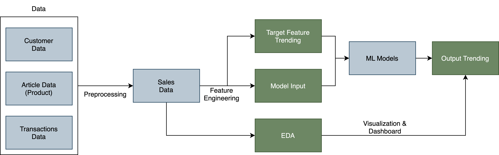
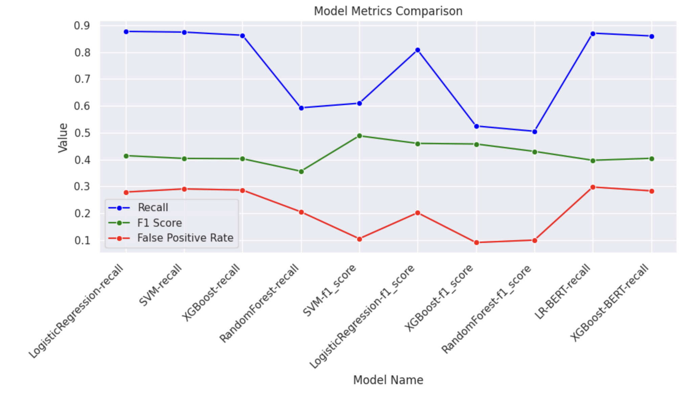

# Demand Forecasting and Trending Item Prediction for H&M Retail Sales
Capstone Project for BrainStation Data Science Bootcamp
---

## The Problem Area

Fast-fashion companies struggle to control inventory. 

- By predicting trending items within a few days of launch, companies can respond to high demands in inventory. 
- This project aims to utilize H&M sales data to predict trending items after a certain period since launch. By analyzing the sales history of H&M products, we can identify patterns and trends that can be used to make informed predictions about which products are likely to become popular in the future.
- The fashion industry is constantly changing, and it can be difficult for companies to keep up with the latest trends. By predicting which products are likely to become popular, H&M can stay ahead of the competition and ensure that they are offering their customers the latest and most desirable products.

## The User

The benefits of predicting trending items:

- Retailers’ marketing approach could be more personalized with trending items predicted. (ex. targeted promotions, recommendations).
- We can understand the features of the trending items, and provide this information to the design, strategy team to improve customer loyalty.
- Inventory management can be greatly improved as we can get a hint of what's going to be selling a lot.

## The Big Idea

To actually help with inventory management, we need to define a response time from ordering to re-stock. The assumption of the project has set the response time to 1 month. (i.e. we can predict an item would be trending in a month, then we can order more a month before)

We have 2 approach to this problem:

1. Binary Classification: Given input of n days of sale of a product (with the features included), can we predict if it is going to reach a certain sales threshold (trending)?

2. Demand Forecasting + Rule: We can create a lag 30 day time series prediction model. After the model is created, we can add rules to specify anomolies (trending sales).

## The Impact

- Increased Sales and Revenue:
By predicting trending items after a certain period since launch, H&M can ensure that they have enough stock to meet demand. This will lead to increased sales and revenue for the company.

- Improved Customer Satisfaction
By having the trending items in stock, H&M can improve customer satisfaction by ensuring that customers can find what they are looking for. This will lead to increased customer loyalty and repeat business.

## The Data

The data is available from the [H&M Personalized Fashion Recommendation Competition on Kaggle](https://www.kaggle.com/competitions/h-and-m-personalized-fashion-recommendations/data?select=transactions_train.csv)

The dataset consists of:

- 105k image files of the product
- the product (article) data
- the customer data
- the transactions data.

We've cleaned and merged the datasets. Here's the merged columns after cleaning:
| #   | Column                        | Dtype  |
|---  | ------                        | -----  |
| 0   | customer_id                   | object |
| 1   | article_id                    | int64  |
| 2   | unit_price                    | float64|
| 3   | units                         | int64  |
| 4   | sales_channel                 | object |
| 5   | prod_name                     | object |
| 6   | product_type_name             | object |
| 7   | product_group_name            | object |
| 8   | graphical_appearance_name     | object |
| 9   | colour_group_name             | object |
| 10  | perceived_colour_value_name   | object |
| 11  | perceived_colour_master_name  | object |
| 12  | department_name               | object |
| 13  | index_name                    | object |
| 14  | index_group_name              | object |
| 15  | section_name                  | object |
| 16  | garment_group_name            | object |
| 17  | detail_desc                   | object |
| 18  | FN                            | bool   |
| 19  | Active                        | bool   |
| 20  | club_member_status            | object |
| 21  | fashion_news_frequency        | object |
| 22  | age                           | float64|
| 23  | postal_code                   | object |

## Project Workflow

In this project we follow the flowchart above, went through data preprocessing phase to merge the data, feature engineering our target feature "trending", and constructed a baseline model with recall = 0.78.

## Data Preprocessing, EDA, and Baseline Modelling

In the first notebook, we've done data preprocessing, EDA, and baseline modelling with H&M sales data. Here are the analysis we've done:

- Data Preprocessing
  - **Articles (product) table**: dealing with coda/name pairs matching for product category related columns, missing values, duplicates.
  - **Customers table**: dealing with missing values (imputation)and check for duplicates.
  - **Transactions table**: dealing with missing values, duplicates, and transform the dataset based on our findings(we identified duplicated rows as purchasing multiple units and created a new column called units that aggregate the duplicates).

- Exploratory Data Analysis
  - **Preliminary EDA**: Analysed and visualized data based on numerical, categorical, and time series features.
  - **Product EDA**: In-depth analysis on different product category related features, visualize data based on hierarchies, and further preprocessing to filter out irrelavant features/data.
  - **Sales EDA (time series)**: Analyzed sales by week case-by-case with products. Selected 1 random product and the top selling product as case study. Visualized growth rate by week.

- Feature Engineering
  - **Target Variable Labelling**: Defined a function that identify "trending" for each product.
  - **Product Table Aggregation**: Aggregate the product table with the created "trending" column as model input.
  - **Input feature engineering**: With the product table, performed vectorization and one-hot encoding to the corresponding features.

- Baseline Modelling
  - Trained a logistic regression model as baseline
  - Implemented imbalanced learning with SMOTE
  - Evaluated the results and looked into feature importance

## Advanced Modelling

In the second notebook, we have continued our work with advanced modelling. Here are some details:

- **Target Variable (Trending)**: Trending is defined as observing a high volume of sales combined with high week-over-week growth. We use specific thresholds to set precisely what 'high' means.

- **Pipeline**: For efficiency purposes and reusability, we created a pipeline that wraps up all our feature engineering steps and modelling with column transformer and pipelines. We've also enabled GPU training with grid search and our pipelines.

- **Modelling**: Train our models with the custom pipeline, do hyperparameter optimization with grid search. (Logistic Regression, SVM, XGBoost, and Random Forest)
    - We've optimized the model with both recall and f1 score,
    - For recall, we discovered that Logistic Regression, XGBoost, and SVM are having similar results (Logreg the best)
    - For f1 score, we discovered that SVM has the highest score.  
 
- **Word Embeddings**: We would like to see if word embeddings would out perform vectorization for our product description input. Here, we've used BERT pretrained model for embedding that. In our modelling, BERT is having similar results with the previous vevtorized input. However, we need to dive in more to validate that. We would delegate that to future works.

- **Interpretable ML**: We've used shapely values to understand which features have high impact on predicting trending. We discovered that certain sections have higher positive/negative impact in predicting trending. We've used a function to take a glimpse into the product image of those sections.

- **Case Studies**: We've implement the pipeline on training only for indivudual product type. We've seen the results change if we train only with certain product types. We've also viewed the shapely values for our case study, and discovered insights corresponding to each case.

## Model Comparisons

The model comparison is shown above:

- We've optimized the model with both recall and f1 score,
- For recall, we discovered that Logistic Regression, XGBoost, and SVM are having similar results (Logreg the best)
- For f1 score, we discovered that SVM has the highest score.  